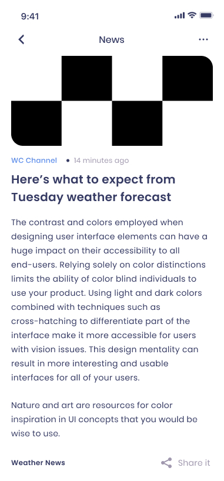

# Weather App

Ứng dụng thời tiết cung cấp thông tin về dự báo thời tiết, bao gồm nhiệt độ, độ ẩm, khả năng mưa và các chỉ số thời tiết khác. Ứng dụng sử dụng OpenWeather API để lấy dữ liệu và hiển thị thông tin thời tiết theo thời gian thực.

## Tính Năng

- **Dự báo thời tiết:** Hiển thị nhiệt độ, độ ẩm, khả năng mưa, chỉ số UV và các chỉ số thời tiết khác.
- **Chế độ tìm kiếm:** Người dùng có thể tìm kiếm thông tin thời tiết của các thành phố trên toàn thế giới.
- **Hiển thị bản đồ:** Tích hợp bản đồ OpenStreetMap để hiển thị vị trí của các thành phố.
- **Chia sẻ thông tin:** Cho phép chia sẻ thông tin thời tiết qua các ứng dụng khác.

## Công Nghệ Sử Dụng

- **Flutter**: Được sử dụng để phát triển ứng dụng di động.
- **Google Fonts**: Để tạo giao diện người dùng đẹp mắt và dễ đọc.
- **OpenWeather API**: Để lấy dữ liệu thời tiết theo thời gian thực.
- **OpenStreetMap**: Để hiển thị bản đồ vị trí thành phố.

## Demo 

Check out the **live web demo** -> _coming soon_

<table>
  <tr>
    <th>Screen</th>
    <th>Preview</th>
    <th>Screen</th>
    <th>Preview</th>
  </tr>
  <tr>
    <td><strong>Begin Screen</strong></td>
    <td></td>
    <td><strong>Get Start Screen</strong></td>
    <td></td>
  </tr>
  <tr>
    <td><strong>Home Screen</strong></td>
    <td></td>
    <td><strong>Home2 Screen</strong></td>
    <td></td>
  </tr>
  </tr>
    <tr>
    <td><strong>Home3 Screen</strong></td>
    <td></td>
    <td><strong>My Location</strong></td>
    <td></td>
  </tr>
  <tr>
    <td><strong>Search City</strong></td>
    <td></td>
    <td><strong>News</strong></td>
    <td></td>
  </tr>
  <tr>
    <td><strong>Home Sidebar</strong></td>
    <td></td>
    <td><strong>Add City</strong></td>
    <td></td>
  </tr>
</table>
## Liên Hệ
- **Nếu bạn có bất kỳ câu hỏi nào hoặc cần hỗ trợ thêm, hãy liên hệ với tôi qua email: nguyenthanhtrungtt20@gmail.com.

